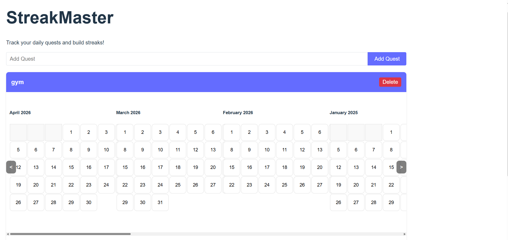

# Productivity Streak Tool

A productivity tool that helps users create streaks to reinforce good habits.
Charts similar to github contributions chart, but for your own day-to-day quests!

## Features

- Track your daily progress.
- Build and maintain streaks for your goals.
- Gain insights into your habits and productivity patterns.



## Getting Started

1. Clone this repository:
   ```bash
   git clone https://github.com/Stargazer10101/streakmaster.git
   ```

2. Navigate to the project directory:
   ```bash
   cd streakmaster
   ```

3. Follow the setup instructions (e.g., install dependencies, run the app).

## Contributing

Contributions are welcome! Please open an issue or submit a pull request.

## License

This project is licensed under the [MIT License](LICENSE).
